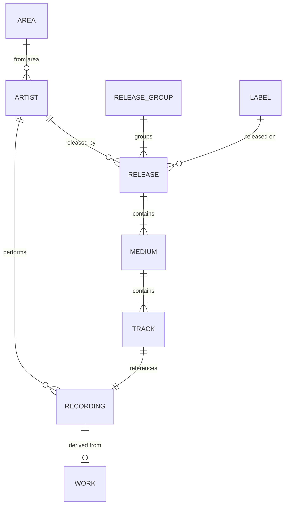

# Core Entities

## Overview

MusicBrainz has seven primary entity types, each identified by a unique MBID (UUID).



## 1. Artist

Represents any individual, group, orchestra, or character that creates music.

### Table: `artist`

```sql
CREATE TABLE artist (
    id                  SERIAL PRIMARY KEY,
    gid                 UUID NOT NULL UNIQUE,  -- MBID
    name                VARCHAR NOT NULL,
    sort_name           VARCHAR NOT NULL,
    begin_date_year     SMALLINT,
    begin_date_month    SMALLINT,
    begin_date_day      SMALLINT,
    end_date_year       SMALLINT,
    end_date_month      SMALLINT,
    end_date_day        SMALLINT,
    type                INTEGER,  -- FK to artist_type
    area                INTEGER,  -- FK to area
    gender              INTEGER,  -- FK to gender
    comment             VARCHAR,
    edits_pending       INTEGER DEFAULT 0,
    last_updated        TIMESTAMP WITH TIME ZONE,
    ended               BOOLEAN DEFAULT FALSE
);
```

### Artist Types
- Person
- Group
- Orchestra
- Choir
- Character
- Other

### Key Relationships
- **artist_credit**: How artist names appear on releases
- **artist_alias**: Alternative names
- **artist_ipi**: Interested Parties Information codes
- **artist_isni**: International Standard Name Identifier

## 2. Release Group

Groups different releases of the same product (e.g., original, remaster, different regions).

### Table: `release_group`

```sql
CREATE TABLE release_group (
    id                  SERIAL PRIMARY KEY,
    gid                 UUID NOT NULL UNIQUE,
    name                VARCHAR NOT NULL,
    artist_credit       INTEGER NOT NULL,  -- FK to artist_credit
    type                INTEGER,  -- FK to release_group_primary_type
    comment             VARCHAR,
    edits_pending       INTEGER DEFAULT 0,
    last_updated        TIMESTAMP WITH TIME ZONE
);
```

### Release Group Types
- **Album**: Standard album release
- **Single**: Single release
- **EP**: Extended play
- **Broadcast**: Broadcast recording
- **Other**: Other types

### Secondary Types
- Compilation
- Soundtrack
- Spokenword
- Interview
- Audiobook
- Live
- Remix
- DJ-mix
- Mixtape/Street

## 3. Release

Represents a specific product you can buy (specific country, label, catalog number, barcode).

### Table: `release`

```sql
CREATE TABLE release (
    id                  SERIAL PRIMARY KEY,
    gid                 UUID NOT NULL UNIQUE,
    name                VARCHAR NOT NULL,
    artist_credit       INTEGER NOT NULL,
    release_group       INTEGER NOT NULL,  -- FK to release_group
    status              INTEGER,  -- FK to release_status
    packaging           INTEGER,  -- FK to release_packaging
    language            INTEGER,  -- FK to language
    script              INTEGER,  -- FK to script
    barcode             VARCHAR,
    comment             VARCHAR,
    edits_pending       INTEGER DEFAULT 0,
    quality             SMALLINT DEFAULT -1,
    last_updated        TIMESTAMP WITH TIME ZONE
);
```

### Release Status
- Official
- Promotion
- Bootleg
- Pseudo-Release

### Related Tables
- **medium**: Physical/digital mediums (CD, Vinyl, Digital)
- **release_country**: Release events by country/date
- **release_label**: Labels and catalog numbers

## 4. Medium

Represents the physical or digital medium (CD, Vinyl, Digital Media, etc.).

### Table: `medium`

```sql
CREATE TABLE medium (
    id                  SERIAL PRIMARY KEY,
    release             INTEGER NOT NULL,  -- FK to release
    position            INTEGER NOT NULL,
    format              INTEGER,  -- FK to medium_format
    name                VARCHAR,
    edits_pending       INTEGER DEFAULT 0,
    last_updated        TIMESTAMP WITH TIME ZONE,
    track_count         INTEGER DEFAULT 0
);
```

### Medium Formats
- CD
- Vinyl (7", 10", 12")
- Digital Media
- Cassette
- DVD
- Blu-ray
- VHS
- And many more...

## 5. Recording

Represents a unique recording (mix, edit) of a song.

### Table: `recording`

```sql
CREATE TABLE recording (
    id                  SERIAL PRIMARY KEY,
    gid                 UUID NOT NULL UNIQUE,
    name                VARCHAR NOT NULL,
    artist_credit       INTEGER NOT NULL,
    length              INTEGER,  -- Duration in milliseconds
    comment             VARCHAR,
    edits_pending       INTEGER DEFAULT 0,
    last_updated        TIMESTAMP WITH TIME ZONE,
    video               BOOLEAN DEFAULT FALSE
);
```

### Key Points
- Length is stored in milliseconds
- Can represent audio or video recordings
- Links to works via relationships
- Can have ISRCs (International Standard Recording Code)

## 6. Track

Represents the appearance of a recording on a specific medium.

### Table: `track`

```sql
CREATE TABLE track (
    id                  SERIAL PRIMARY KEY,
    gid                 UUID NOT NULL UNIQUE,
    recording           INTEGER NOT NULL,  -- FK to recording
    medium              INTEGER NOT NULL,  -- FK to medium
    position            INTEGER NOT NULL,
    number              TEXT NOT NULL,  -- Can include things like "A1", "1-1"
    name                VARCHAR NOT NULL,
    artist_credit       INTEGER NOT NULL,
    length              INTEGER,  -- Can override recording length
    edits_pending       INTEGER DEFAULT 0,
    last_updated        TIMESTAMP WITH TIME ZONE,
    is_data_track       BOOLEAN DEFAULT FALSE
);
```

### Important Notes
- Track number can be non-numeric (e.g., "A1" for vinyl side A, track 1)
- Position is numeric ordering
- Can have different artist credit than the recording

## 7. Work

Represents the composition/song as a distinct entity from recordings.

### Table: `work`

```sql
CREATE TABLE work (
    id                  SERIAL PRIMARY KEY,
    gid                 UUID NOT NULL UNIQUE,
    name                VARCHAR NOT NULL,
    type                INTEGER,  -- FK to work_type
    comment             VARCHAR,
    edits_pending       INTEGER DEFAULT 0,
    last_updated        TIMESTAMP WITH TIME ZONE
);
```

### Work Types
- Song
- Symphony
- Concerto
- Opera
- Soundtrack
- And many more...

### Key Relationships
- **ISWC**: International Standard Musical Work Code
- **work_attribute**: Attributes like key, language
- Works can have parent-child relationships (e.g., movement in symphony)

## 8. Label

Represents record labels and imprints.

### Table: `label`

```sql
CREATE TABLE label (
    id                  SERIAL PRIMARY KEY,
    gid                 UUID NOT NULL UNIQUE,
    name                VARCHAR NOT NULL,
    begin_date_year     SMALLINT,
    begin_date_month    SMALLINT,
    begin_date_day      SMALLINT,
    end_date_year       SMALLINT,
    end_date_month      SMALLINT,
    end_date_day        SMALLINT,
    label_code          INTEGER,  -- Label Code (LC)
    type                INTEGER,  -- FK to label_type
    area                INTEGER,  -- FK to area
    comment             VARCHAR,
    edits_pending       INTEGER DEFAULT 0,
    last_updated        TIMESTAMP WITH TIME ZONE,
    ended               BOOLEAN DEFAULT FALSE
);
```

## 9. Area

Represents geographic regions (countries, cities, subdivisions).

### Table: `area`

```sql
CREATE TABLE area (
    id                  SERIAL PRIMARY KEY,
    gid                 UUID NOT NULL UNIQUE,
    name                VARCHAR NOT NULL,
    type                INTEGER,  -- FK to area_type
    edits_pending       INTEGER DEFAULT 0,
    last_updated        TIMESTAMP WITH TIME ZONE,
    ended               BOOLEAN DEFAULT FALSE,
    comment             VARCHAR
);
```

### Area Types
- Country
- Subdivision (state, province)
- City
- Municipality
- District
- Island

## Artist Credit System

A special concept that represents how artists appear on releases/recordings.


### Tables: `artist_credit` and `artist_credit_name`

```sql
CREATE TABLE artist_credit (
    id                  SERIAL PRIMARY KEY,
    name                VARCHAR NOT NULL,
    artist_count        SMALLINT NOT NULL,
    ref_count           INTEGER DEFAULT 0
);

CREATE TABLE artist_credit_name (
    artist_credit       INTEGER NOT NULL,  -- FK to artist_credit
    position            SMALLINT NOT NULL,
    artist              INTEGER NOT NULL,  -- FK to artist
    name                VARCHAR NOT NULL,  -- How artist name appears
    join_phrase         TEXT,  -- Text between artists
    PRIMARY KEY (artist_credit, position)
);
```

This allows for:
- Various artist
- Collaborations ("Artist A & Artist B")
- Featured artists ("Artist A feat. Artist B")
- Localized names
