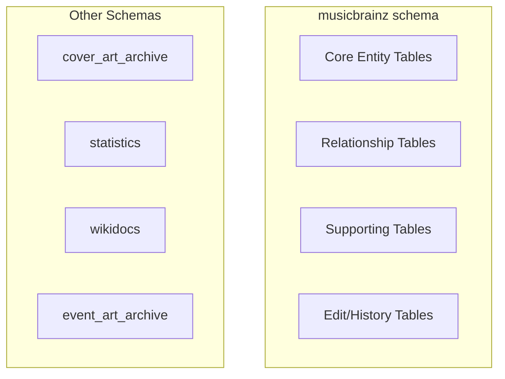
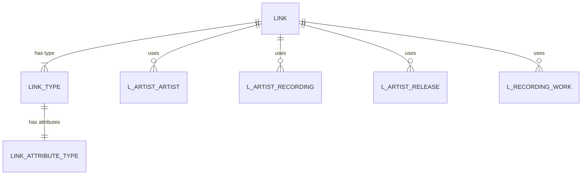
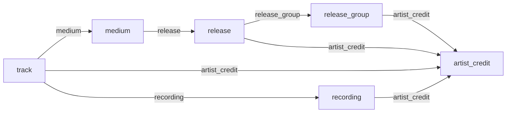

# Schema Structure

## Database Organization

The MusicBrainz database uses several PostgreSQL schemas to organize its tables logically.



## Table Categories

### 1. Core Entity Tables

Main tables storing the primary entities:

```
artist
release_group
release
medium
track
recording
work
label
area
place
event
series
instrument
genre
```

### 2. Relationship Tables (Advanced Relationships)

The relationship system uses a sophisticated entity-attribute-value pattern.



#### Core Relationship Tables

```sql
-- Link type definitions
CREATE TABLE link_type (
    id                  SERIAL PRIMARY KEY,
    parent              INTEGER,  -- FK to link_type (for hierarchy)
    child_order         INTEGER DEFAULT 0,
    gid                 UUID NOT NULL UNIQUE,
    entity_type0        VARCHAR NOT NULL,  -- First entity type
    entity_type1        VARCHAR NOT NULL,  -- Second entity type
    name                VARCHAR NOT NULL,
    description         TEXT,
    link_phrase         VARCHAR NOT NULL,  -- Forward direction
    reverse_link_phrase VARCHAR NOT NULL,  -- Reverse direction
    long_link_phrase    VARCHAR NOT NULL,
    priority            INTEGER DEFAULT 0,
    last_updated        TIMESTAMP WITH TIME ZONE,
    is_deprecated       BOOLEAN DEFAULT FALSE,
    has_dates           BOOLEAN DEFAULT TRUE,
    entity0_cardinality SMALLINT DEFAULT 0,
    entity1_cardinality SMALLINT DEFAULT 0
);

-- Actual links between entities
CREATE TABLE link (
    id                  SERIAL PRIMARY KEY,
    link_type           INTEGER NOT NULL,  -- FK to link_type
    begin_date_year     SMALLINT,
    begin_date_month    SMALLINT,
    begin_date_day      SMALLINT,
    end_date_year       SMALLINT,
    end_date_month      SMALLINT,
    end_date_day        SMALLINT,
    attribute_count     INTEGER DEFAULT 0,
    created             TIMESTAMP WITH TIME ZONE DEFAULT NOW(),
    ended               BOOLEAN DEFAULT FALSE
);
```

#### Entity Pair Tables (l_* tables)

For each pair of entity types, there's a linking table:

```sql
-- Example: Artist to Artist relationships
CREATE TABLE l_artist_artist (
    id                  SERIAL PRIMARY KEY,
    link                INTEGER NOT NULL,  -- FK to link
    entity0             INTEGER NOT NULL,  -- FK to artist
    entity1             INTEGER NOT NULL,  -- FK to artist
    edits_pending       INTEGER DEFAULT 0,
    last_updated        TIMESTAMP WITH TIME ZONE,
    link_order          INTEGER DEFAULT 0,
    entity0_credit      TEXT DEFAULT '',
    entity1_credit      TEXT DEFAULT ''
);

-- Other l_* tables follow the same pattern:
-- l_artist_recording
-- l_artist_release
-- l_artist_release_group
-- l_artist_work
-- l_artist_label
-- l_artist_url
-- l_recording_recording
-- l_recording_work
-- l_release_release
-- l_release_release_group
-- l_release_url
-- ... and many more
```

### 3. Supporting Tables

#### Naming and Aliases

```sql
-- Artist aliases
CREATE TABLE artist_alias (
    id                  SERIAL PRIMARY KEY,
    artist              INTEGER NOT NULL,  -- FK to artist
    name                VARCHAR NOT NULL,
    locale              TEXT,
    edits_pending       INTEGER DEFAULT 0,
    last_updated        TIMESTAMP WITH TIME ZONE,
    type                INTEGER,  -- FK to artist_alias_type
    sort_name           VARCHAR NOT NULL,
    begin_date_year     SMALLINT,
    begin_date_month    SMALLINT,
    begin_date_day      SMALLINT,
    end_date_year       SMALLINT,
    end_date_month      SMALLINT,
    end_date_day        SMALLINT,
    primary_for_locale  BOOLEAN DEFAULT FALSE,
    ended               BOOLEAN DEFAULT FALSE
);
```

Similar tables exist for all core entities:
- `release_alias`
- `work_alias`
- `label_alias`
- `area_alias`
- etc.

#### External Identifiers

```sql
-- ISRCs for recordings
CREATE TABLE isrc (
    id                  SERIAL PRIMARY KEY,
    recording           INTEGER NOT NULL,  -- FK to recording
    isrc                CHAR(12) NOT NULL,
    source              SMALLINT,
    edits_pending       INTEGER DEFAULT 0,
    created             TIMESTAMP WITH TIME ZONE DEFAULT NOW()
);

-- Other identifier tables:
-- iswc (for works)
-- ipi (for artists/labels)
-- isni (for artists/labels)
```

#### Tags and Ratings

```sql
-- User-submitted tags
CREATE TABLE artist_tag (
    artist              INTEGER NOT NULL,  -- FK to artist
    tag                 INTEGER NOT NULL,  -- FK to tag
    count               INTEGER NOT NULL,
    last_updated        TIMESTAMP WITH TIME ZONE,
    PRIMARY KEY (artist, tag)
);

-- Aggregate tags
CREATE TABLE tag (
    id                  SERIAL PRIMARY KEY,
    name                VARCHAR NOT NULL UNIQUE,
    ref_count           INTEGER DEFAULT 0
);

-- User ratings
CREATE TABLE artist_rating_raw (
    artist              INTEGER NOT NULL,  -- FK to artist
    editor              INTEGER NOT NULL,  -- FK to editor
    rating              SMALLINT NOT NULL CHECK (rating >= 0 AND rating <= 100),
    PRIMARY KEY (artist, editor)
);
```

### 4. Edit System Tables

MusicBrainz tracks all changes through an edit system.

```sql
CREATE TABLE edit (
    id                  SERIAL PRIMARY KEY,
    editor              INTEGER NOT NULL,  -- FK to editor
    type                SMALLINT NOT NULL,
    status              SMALLINT NOT NULL,
    autoedit            SMALLINT DEFAULT 0,
    open_time           TIMESTAMP WITH TIME ZONE DEFAULT NOW(),
    close_time          TIMESTAMP WITH TIME ZONE,
    expire_time         TIMESTAMP WITH TIME ZONE NOT NULL,
    language            INTEGER,
    quality             SMALLINT DEFAULT 1
);

CREATE TABLE edit_data (
    edit                INTEGER NOT NULL,  -- FK to edit
    data                JSONB NOT NULL
);

-- Tracks which entities were affected by edits
CREATE TABLE edit_artist (
    edit                INTEGER NOT NULL,  -- FK to edit
    artist              INTEGER NOT NULL,  -- FK to artist
    status              SMALLINT NOT NULL,
    PRIMARY KEY (edit, artist, status)
);
```

Similar `edit_*` tables exist for all entity types.

### 5. URL and Annotation Tables

```sql
CREATE TABLE url (
    id                  SERIAL PRIMARY KEY,
    gid                 UUID NOT NULL UNIQUE,
    url                 TEXT NOT NULL,
    edits_pending       INTEGER DEFAULT 0,
    last_updated        TIMESTAMP WITH TIME ZONE
);

-- Annotations (editor notes)
CREATE TABLE artist_annotation (
    artist              INTEGER NOT NULL,  -- FK to artist
    annotation          INTEGER NOT NULL,  -- FK to annotation
    PRIMARY KEY (artist, annotation)
);

CREATE TABLE annotation (
    id                  SERIAL PRIMARY KEY,
    editor              INTEGER NOT NULL,  -- FK to editor
    text                TEXT,
    changelog           VARCHAR,
    created             TIMESTAMP WITH TIME ZONE DEFAULT NOW()
);
```

### 6. Enumeration Tables

Type and status tables for controlled vocabularies:

```
artist_type
release_group_primary_type
release_group_secondary_type
release_status
release_packaging
medium_format
work_type
label_type
area_type
place_type
gender
language
script
```

Example:

```sql
CREATE TABLE artist_type (
    id                  SERIAL PRIMARY KEY,
    name                VARCHAR NOT NULL,
    parent              INTEGER,  -- FK to artist_type
    child_order         INTEGER DEFAULT 0,
    description         TEXT,
    gid                 UUID NOT NULL UNIQUE
);
```

## Index Strategy

MusicBrainz uses extensive indexing for performance:

```sql
-- GID indexes for UUID lookups
CREATE UNIQUE INDEX artist_idx_gid ON artist (gid);
CREATE UNIQUE INDEX release_idx_gid ON release (gid);

-- Name indexes for searches
CREATE INDEX artist_idx_name ON artist (name);
CREATE INDEX artist_idx_sort_name ON artist (sort_name);

-- Foreign key indexes
CREATE INDEX medium_idx_release ON medium (release);
CREATE INDEX track_idx_recording ON track (recording);

-- Text search indexes
CREATE INDEX artist_idx_txt ON artist USING gin(to_tsvector('mb_simple', name));

-- Relationship indexes
CREATE INDEX l_artist_recording_idx_entity0 ON l_artist_recording (entity0);
CREATE INDEX l_artist_recording_idx_entity1 ON l_artist_recording (entity1);
```

## Table Statistics

Approximate row counts (as of 2024):

```
artist:              ~2.5M rows
release_group:       ~2.3M rows
release:             ~3.8M rows
medium:              ~5.2M rows
track:               ~50M rows
recording:           ~35M rows
work:                ~3.5M rows
label:               ~70K rows
url:                 ~8M rows

Relationship tables: ~200M+ rows combined
```

## Foreign Key Relationships



## Materialized Views

MusicBrainz uses some materialized views for performance:

```sql
-- Materialized view for artist credit counts
CREATE MATERIALIZED VIEW artist_release_count AS
SELECT artist_credit, COUNT(*) as count
FROM release
GROUP BY artist_credit;
```

## Partitioning

Some large tables use partitioning:

```sql
-- Edit tables are partitioned by year
CREATE TABLE edit_2024 PARTITION OF edit
FOR VALUES FROM ('2024-01-01') TO ('2025-01-01');
```

## Database Size Breakdown

Typical space usage:

- Core entity tables: ~50GB
- Relationship tables: ~100GB
- Edit history: ~80GB
- Indexes: ~100GB
- Other/supporting: ~20GB

**Total: ~350GB uncompressed**
