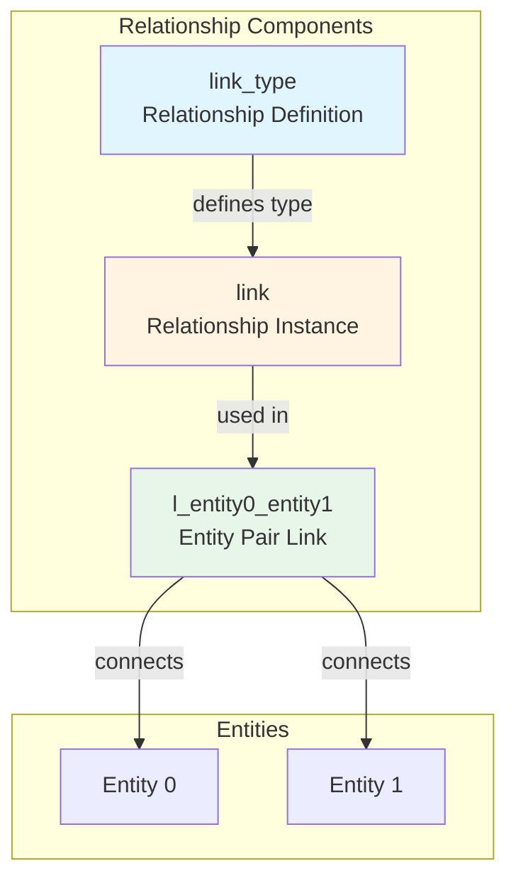
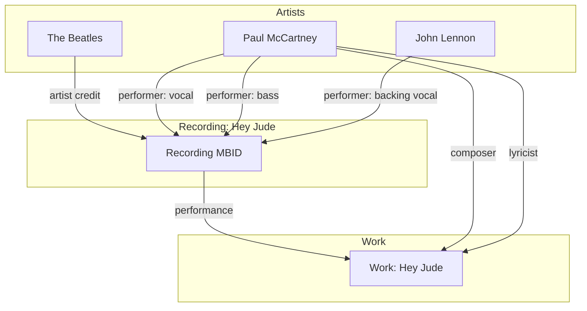

# Relationships System

## Overview

MusicBrainz uses an Advanced Relationship (AR) system to create typed, directional links between any two entities. This is one of the most powerful features of the database.

## Architecture



## Link Types

### Table: `link_type`

Defines the types of relationships possible between entities.

```sql
CREATE TABLE link_type (
    id                  SERIAL PRIMARY KEY,
    gid                 UUID NOT NULL UNIQUE,
    entity_type0        VARCHAR NOT NULL,  -- e.g., 'artist'
    entity_type1        VARCHAR NOT NULL,  -- e.g., 'recording'
    name                VARCHAR NOT NULL,   -- e.g., 'performer'
    parent              INTEGER,            -- Hierarchical organization
    child_order         INTEGER,
    description         TEXT,
    link_phrase         VARCHAR NOT NULL,   -- 'performed'
    reverse_link_phrase VARCHAR NOT NULL,   -- 'performer'
    long_link_phrase    VARCHAR NOT NULL,   -- 'performed on'
    priority            INTEGER DEFAULT 0,
    last_updated        TIMESTAMP WITH TIME ZONE,
    is_deprecated       BOOLEAN DEFAULT FALSE,
    has_dates           BOOLEAN DEFAULT TRUE,
    entity0_cardinality SMALLINT,  -- 0=many, 1=one
    entity1_cardinality SMALLINT
);
```

### Link Type Hierarchy

Link types are organized hierarchically:

```
artist-recording
├── performer
│   ├── vocal
│   │   ├── lead vocals
│   │   ├── background vocals
│   │   └── choir vocals
│   └── instrument
│       ├── guitar
│       ├── drums
│       └── piano
├── composer
├── lyricist
└── conductor
```

### Common Link Types

#### Artist-Recording

```sql
-- Example: Who performed on a recording
SELECT
    lt.name as relationship_type,
    lt.link_phrase,
    lt.reverse_link_phrase
FROM link_type lt
WHERE lt.entity_type0 = 'artist'
  AND lt.entity_type1 = 'recording';
```

Common types:
- performer (vocal, instruments)
- composer
- conductor
- lyricist
- arranger
- producer
- engineer
- mixer

#### Artist-Release

- label
- published
- manufactured
- distributed

#### Recording-Work

- performance (most common - recording is a performance of work)
- medley
- cover
- samples material from

#### Artist-Artist

- member of band
- collaboration
- married
- parent/child
- sibling
- teacher/student

#### Release-Release

- transl-tracklisting (transliterated)
- remaster
- pseudo-release
- part of set

## Links and Link Attributes

### Table: `link`

Instances of relationships with dates and attributes.

```sql
CREATE TABLE link (
    id                  SERIAL PRIMARY KEY,
    link_type           INTEGER NOT NULL,  -- FK to link_type
    begin_date_year     SMALLINT,
    begin_date_month    SMALLINT,
    begin_date_day      SMALLINT,
    end_date_year       SMALLINT,
    end_date_month      SMALLINT,
    end_date_day        SMALLINT,
    attribute_count     INTEGER DEFAULT 0,
    created             TIMESTAMP WITH TIME ZONE DEFAULT NOW(),
    ended               BOOLEAN DEFAULT FALSE
);
```

### Link Attributes

Links can have additional attributes:

```sql
CREATE TABLE link_attribute_type (
    id                  SERIAL PRIMARY KEY,
    parent              INTEGER,  -- FK to link_attribute_type
    root                INTEGER NOT NULL,  -- FK to root attribute
    child_order         INTEGER DEFAULT 0,
    gid                 UUID NOT NULL UNIQUE,
    name                VARCHAR NOT NULL,
    description         TEXT,
    last_updated        TIMESTAMP WITH TIME ZONE
);

CREATE TABLE link_attribute (
    link                INTEGER NOT NULL,  -- FK to link
    attribute_type      INTEGER NOT NULL,  -- FK to link_attribute_type
    created             TIMESTAMP WITH TIME ZONE DEFAULT NOW(),
    PRIMARY KEY (link, attribute_type)
);

-- Text values for attributes
CREATE TABLE link_attribute_text_value (
    link                INTEGER NOT NULL,  -- FK to link
    attribute_type      INTEGER NOT NULL,  -- FK to link_attribute_type
    text_value          TEXT NOT NULL,
    PRIMARY KEY (link, attribute_type)
);
```

Example attributes:
- **instrument**: guitar, drums, piano (for performer relationships)
- **vocal**: lead vocals, background vocals
- **number**: catalog number, matrix number
- **additional**: guest, solo, live

## Entity Pair Tables (l_* tables)

For each combination of entity types, there's a specific table.

### Naming Convention

`l_{entity_type0}_{entity_type1}`

Where entity types are alphabetically ordered, except URLs which are always second.

### Example: Artist-Recording

```sql
CREATE TABLE l_artist_recording (
    id                  SERIAL PRIMARY KEY,
    link                INTEGER NOT NULL,  -- FK to link
    entity0             INTEGER NOT NULL,  -- FK to artist
    entity1             INTEGER NOT NULL,  -- FK to recording
    edits_pending       INTEGER DEFAULT 0,
    last_updated        TIMESTAMP WITH TIME ZONE,
    link_order          INTEGER DEFAULT 0,  -- Order when multiple links
    entity0_credit      TEXT DEFAULT '',    -- Credited name override
    entity1_credit      TEXT DEFAULT ''
);

CREATE INDEX l_artist_recording_idx_entity0 ON l_artist_recording (entity0);
CREATE INDEX l_artist_recording_idx_entity1 ON l_artist_recording (entity1);
CREATE INDEX l_artist_recording_idx_link ON l_artist_recording (link);
```

### All l_* Tables

```
l_area_area
l_area_artist
l_area_event
l_area_instrument
l_area_label
l_area_place
l_area_recording
l_area_release
l_area_release_group
l_area_series
l_area_url
l_area_work
l_artist_artist
l_artist_event
l_artist_instrument
l_artist_label
l_artist_place
l_artist_recording
l_artist_release
l_artist_release_group
l_artist_series
l_artist_url
l_artist_work
l_event_event
l_event_instrument
l_event_label
l_event_place
l_event_recording
l_event_release
l_event_release_group
l_event_series
l_event_url
l_event_work
... (and many more)
```

## Querying Relationships

### Example 1: Get all performers on a recording

```sql
SELECT
    a.name as artist_name,
    lt.name as relationship,
    lat.name as attribute,
    latv.text_value,
    lar.entity0_credit
FROM recording r
JOIN l_artist_recording lar ON lar.entity1 = r.id
JOIN link l ON l.id = lar.link
JOIN link_type lt ON lt.id = l.link_type
JOIN artist a ON a.id = lar.entity0
LEFT JOIN link_attribute la ON la.link = l.id
LEFT JOIN link_attribute_type lat ON lat.id = la.attribute_type
LEFT JOIN link_attribute_text_value latv
    ON latv.link = l.id AND latv.attribute_type = lat.id
WHERE r.gid = '5b11f4ce-a62d-471e-81fc-a69a8278c7da'
  AND lt.name IN ('performer', 'vocal', 'instrument')
ORDER BY lar.link_order;
```

### Example 2: Get work for a recording

```sql
SELECT
    w.name as work_name,
    w.gid as work_mbid,
    lt.name as relationship_type
FROM recording rec
JOIN l_recording_work lrw ON lrw.entity0 = rec.id
JOIN work w ON w.id = lrw.entity1
JOIN link l ON l.id = lrw.link
JOIN link_type lt ON lt.id = l.link_type
WHERE rec.gid = '5b11f4ce-a62d-471e-81fc-a69a8278c7da';
```

### Example 3: Get band members with dates

```sql
SELECT
    member.name as member_name,
    band.name as band_name,
    l.begin_date_year,
    l.end_date_year,
    l.ended
FROM artist band
JOIN l_artist_artist laa ON laa.entity1 = band.id
JOIN link l ON l.id = laa.link
JOIN link_type lt ON lt.id = l.link_type
JOIN artist member ON member.id = laa.entity0
WHERE band.gid = 'b10bbbfc-cf9e-42e0-be17-e2c3e1d2600d'  -- The Beatles
  AND lt.name = 'member of band'
ORDER BY l.begin_date_year;
```

### Example 4: URLs for an artist

```sql
SELECT
    u.url,
    lt.name as url_type
FROM artist a
JOIN l_artist_url lau ON lau.entity0 = a.id
JOIN url u ON u.id = lau.entity1
JOIN link l ON l.id = lau.link
JOIN link_type lt ON lt.id = l.link_type
WHERE a.gid = 'b10bbbfc-cf9e-42e0-be17-e2c3e1d2600d'
ORDER BY lt.name;
```

## Relationship Visualization



## Relationship Credits

The `entity0_credit` and `entity1_credit` fields allow overriding displayed names:

```sql
-- Example: Artist credited differently on a specific release
UPDATE l_artist_release
SET entity0_credit = 'Prince and The Revolution'
WHERE entity0 = (SELECT id FROM artist WHERE gid = 'prince-mbid')
  AND entity1 = (SELECT id FROM release WHERE gid = 'purple-rain-release-mbid');
```

## Best Practices

### 1. Always Join Through link_type

```sql
-- Good: Filters at link_type level
SELECT ...
FROM l_artist_recording lar
JOIN link l ON l.id = lar.link
JOIN link_type lt ON lt.id = l.link_type
WHERE lt.name = 'performer';

-- Less efficient: Filters after joining
SELECT ...
FROM l_artist_recording lar
WHERE lar.link IN (
    SELECT l.id FROM link l
    JOIN link_type lt ON lt.id = l.link_type
    WHERE lt.name = 'performer'
);
```

### 2. Use Indexes on Entity Columns

The entity0 and entity1 columns are heavily indexed - use them for filtering.

### 3. Consider Relationship Hierarchy

When querying, decide if you want:
- Specific type only: `lt.name = 'guitar'`
- Type and children: Use recursive CTE on link_type.parent

### 4. Handle NULL Attributes

Not all links have attributes:

```sql
LEFT JOIN link_attribute la ON la.link = l.id
```

### 5. Check Ended Flag

```sql
WHERE l.ended = FALSE  -- Only active relationships
```

## Performance Considerations

- Relationship tables are very large (200M+ rows)
- Always filter by entity ID when possible
- Use appropriate indexes (entity0, entity1, link)
- Consider caching common relationship queries
- Materialized views can help for aggregate queries
