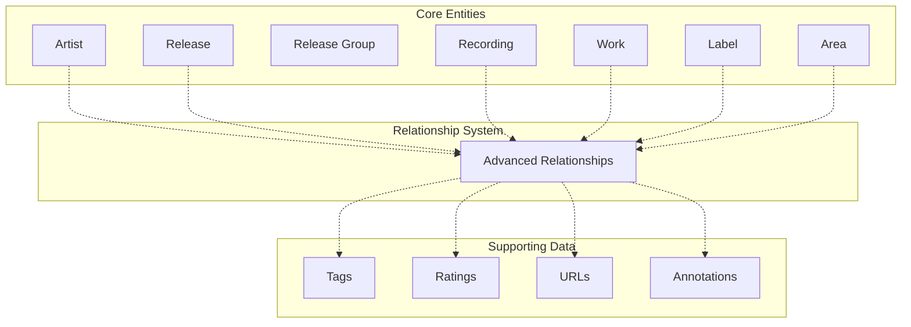
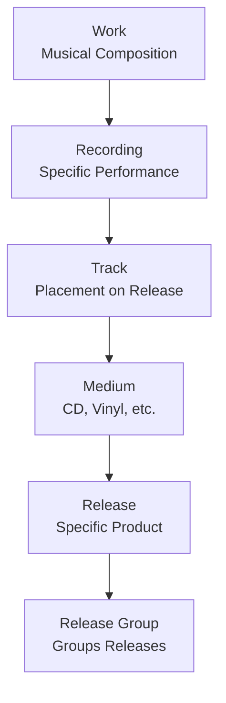

# MusicBrainz Database Overview

## What is MusicBrainz?

MusicBrainz is an open music encyclopedia that maintains a comprehensive database of music metadata. The database is available as a PostgreSQL dump that can be downloaded and self-hosted.

## Database Characteristics

- **Database Type**: PostgreSQL (version 12+)
- **Size**: ~30GB compressed, ~300GB uncompressed (as of 2024)
- **Schema**: Complex relational schema with 200+ tables
- **License**: CC0 (public domain) and some data under specific licenses
- **Update Frequency**: Real-time via replication packets

## Core Architecture



## Key Concepts

### MBIDs (MusicBrainz Identifiers)
All core entities use UUIDs (version 4) as primary identifiers, called MBIDs. These are globally unique and persistent.

```sql
-- Example MBID
5b11f4ce-a62d-471e-81fc-a69a8278c7da
```

### The Four-Tier Release Hierarchy



## Getting the Database

### Download Options

1. **Full Database Dump**: Complete PostgreSQL dump
   - URL: https://metabrainz.org/datasets/musicbrainz
   - Updated weekly

2. **Replication Packets**: Incremental updates
   - For keeping database in sync
   - Available hourly

3. **Virtual Machine**: Pre-configured VM image
   - Fastest way to get started

## Database Schemas

The database uses multiple PostgreSQL schemas:

- **musicbrainz**: Core tables (artists, releases, etc.)
- **cover_art_archive**: Cover art metadata
- **event_art_archive**: Event imagery metadata
- **wikidocs**: Wiki documentation
- **statistics**: Statistical data
- **documentation**: Schema documentation

## Installation Requirements

### Minimum System Requirements
- **RAM**: 8GB (16GB+ recommended)
- **Disk**: 500GB free space
- **PostgreSQL**: Version 12 or higher
- **CPU**: Multi-core recommended for initial import

### Typical Setup Time
- Download: 2-6 hours (depending on connection)
- Import: 12-48 hours (depending on hardware)

## Connection Pattern

```sql
-- Basic connection
psql -h localhost -U musicbrainz -d musicbrainz_db

-- Enable extensions used by MusicBrainz
CREATE EXTENSION IF NOT EXISTS "uuid-ossp";
CREATE EXTENSION IF NOT EXISTS "cube";
CREATE EXTENSION IF NOT EXISTS "earthdistance";
```

## Next Steps

- [Core Entities](01-core-entities.md) - Understand the main data structures
- [Schema Structure](02-schema-structure.md) - Detailed table organization
- [Relationships](03-relationships.md) - How entities connect
- [Querying Guide](04-querying-guide.md) - Common queries and patterns
- [Replication](./05-replication.md) - Keeping data up-to-date
